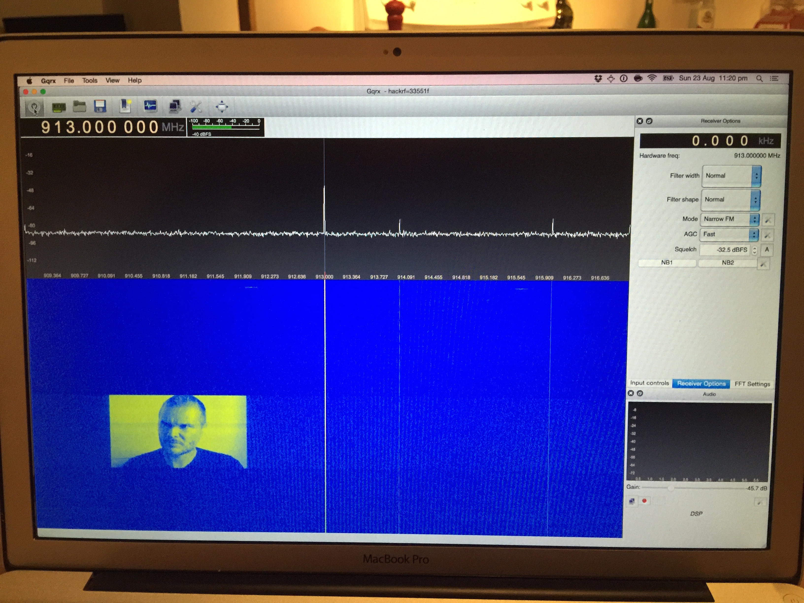

## HackRF Node Stream Spectrum Painter

Folks were playing around with [Hellschreiber](https://en.wikipedia.org/wiki/Hellschreiber) encoding in the #hackrf channel on Freenode last week using `hackrf_transfer`

<blockquote class="twitter-tweet" data-partner="tweetdeck"><p lang="en" dir="ltr">HackRF&#39;s tx/rx&#39;ing images in waterfall plots using <a href="http://t.co/Lyijkr63QP">http://t.co/Lyijkr63QP</a> <a href="http://t.co/JwLsO29dqC">http://t.co/JwLsO29dqC</a> <a href="https://twitter.com/hashtag/SDR?src=hash">#SDR</a> <a href="https://twitter.com/hashtag/HackRF?src=hash">#HackRF</a> <a href="http://t.co/aAKk4eLBgV">pic.twitter.com/aAKk4eLBgV</a></p>&mdash; ☞ Gareth (@gyaresu) <a href="https://twitter.com/gyaresu/status/634796029859131396">August 21, 2015</a></blockquote>
<script async src="//platform.twitter.com/widgets.js" charset="utf-8"></script>


Which then made me remember a tweet from @maxogden playing around with a `hackrf` `node` module at the [CCC](https://www.ccc.de/en/) 2015 camp last week.

And using a `hackrf` via `node` is something I've wanted since before it was even a `thing`.

### Spectrum Painter 

##### Use [Spectrum Painter](https://github.com/polygon/spectrum_painter) to create an IQ stream:

```bash
python spectrum_painter/img2iqstream.py examples/gareth.png --samplerate 8000000 --format hackrf > gareth.raw
```

##### Then test with `hackrf_transfer`: 
```bash
hackrf_transfer -f 915000000 -s 3700000 -t gareth.raw -x 20 -a 1
```

##### Show the transmission on a second machine with `gqrx`:
[GQRX](http://gqrx.dk) is a multi-platform software reciever with waterfall plot.

You might need to tweak some of the sample rate / fft settings in both `hackrf_transfer` & `gqrx` to get the correct aspect ratio but it's not difficult.

### HackRF for Node

##### So I wrote something straight from my brain using [hackrf-stream](https://github.com/mappum/hackrf-stream)...


```node
var devices = require('hackrf-stream')
var fs = require('fs')

var radio = devices(0).open(0)

radio.setFrequency(9.15e8)

radio.setSampleRate(3.7e6)

var tx = radio.createWriteStream()

fs.readFile('./gareth.raw', function (err, data) {
  if (err) {
    throw err
  }
  tx.write(data)
})
```
##### ... and it worked.


_I managed to capture the very first code test. While in utter shock it actually worked!_
